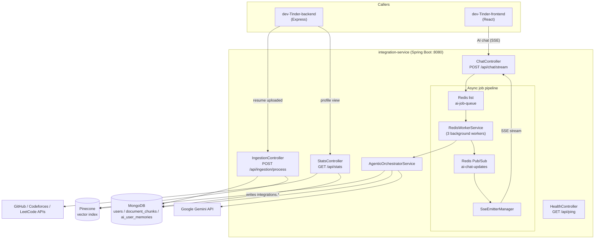
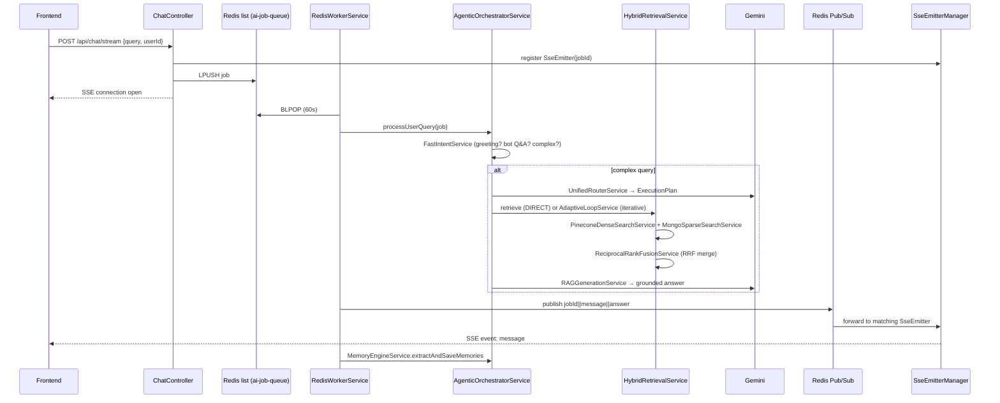
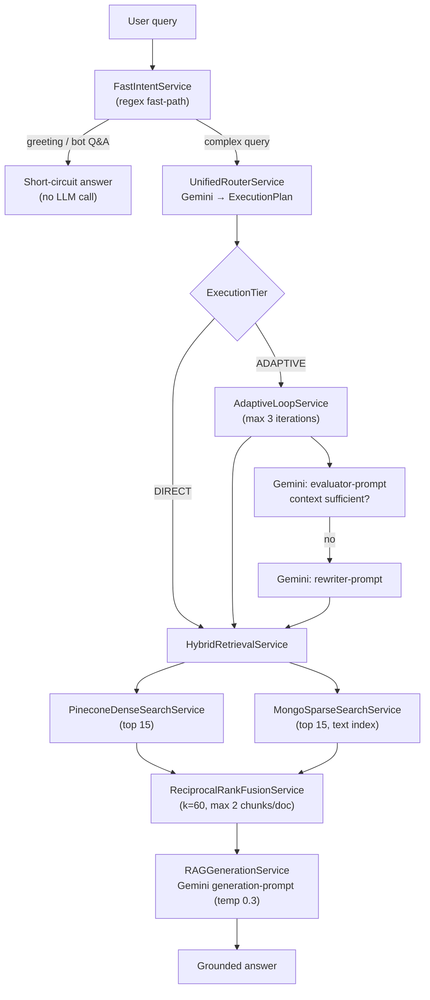
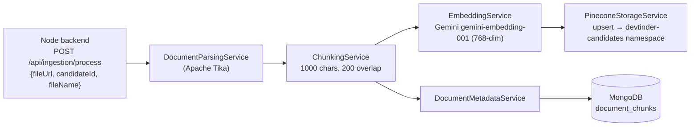

# DevTinder — Integration Service

Java 21 / Spring Boot 4 microservice that powers three things for DevTinder: **developer-platform stats aggregation** (GitHub/Codeforces/LeetCode), a **resume ingestion pipeline** (parse → chunk → embed → store), and an **agentic RAG "AI Recruiter" chat** over all ingested resumes.

## Tech stack

| Concern | Choice |
|---|---|
| Framework | Spring Boot 4 (Web MVC), Java 21 |
| Database | MongoDB (shared with the Node backend's `users` collection, plus its own `document_chunks` / `ai_user_memories`) |
| Vector store | Pinecone (`devtinder-intelligence-hub` index, `devtinder-candidates` namespace) |
| LLM | Google Gemini (routing, evaluation, query rewriting, generation, memory extraction, embeddings) |
| Job queue / fan-out | Redis — a blocking list (`ai-job-queue`) as the work queue, Pub/Sub (`ai-chat-updates`) to relay results to open SSE connections |
| Document parsing | Apache Tika |
| Build | Maven (wrapper included) |

## Why it exists

The Node backend owns users, connections and chat. This service does the heavier, LLM/vector-search-dependent work that doesn't belong in the request/response path of a Node API: talking to three external stats APIs, parsing and embedding PDFs, and running a multi-step retrieval-augmented chat agent. The Node backend and the React frontend both call into it directly, for different features.

## Architecture



## Agentic chat pipeline (the interesting part)

Chat requests are decoupled from the HTTP thread: the controller enqueues a job and returns an `SseEmitter`; a worker pool processes it and publishes results back over Redis Pub/Sub.



### Routing & retrieval logic



## Resume ingestion pipeline



## Package structure (`src/main/java/integration_service/`)

> Package is `integration_service` (underscore) — `integration-service` is not a valid Java package identifier (documented in `HELP.md`).

| Layer | Classes |
|---|---|
| Controllers | `HealthController`, `StatsController`, `IngestionController`, `ChatController` |
| Config | `RedisConfig` (Pub/Sub listener wiring) |
| Job pipeline | `SseEmitterManager`, `RedisWorkerService`, `RedisStreamListener` |
| Orchestration | `AgenticOrchestratorService`, `FastIntentService`, `UnifiedRouterService` |
| Retrieval | `HybridRetrievalService`, `PineconeDenseSearchService`, `MongoSparseSearchService`, `ReciprocalRankFusionService`, `AdaptiveLoopService` |
| Generation & memory | `RAGGenerationService`, `MemoryEngineService` |
| Ingestion | `DocumentParsingService`, `ChunkingService`, `PineconeStorageService`, `DocumentMetadataService`, `EmbeddingService` |
| Stats | `StatsService` (+ DTOs: `GitHubStats`, `CodeforcesStats`, `CodeforcesResponse`, `LeetcodeStats`) |
| Models | `DocumentChunk`, `UserMemory`, `IntentType`, `routing.ExecutionPlan` (+ `ExecutionTier`, `RetrievalMode`, `Strategy`) |
| Repositories | `DocumentChunkRepository`, `UserMemoryRepository` |
| Prompts | `resources/prompts/*.txt` — router, evaluator, rewriter, generation, memory-extraction |

## API reference

| Method | Route | Caller | Description |
|---|---|---|---|
| GET | `/api/ping` | — | Liveness check |
| GET | `/api/stats?github=&codeforces=&leetcode=&userId=` | Node backend | Aggregates dev-platform stats; writes back to `users.integrations` in Mongo |
| POST | `/api/ingestion/process` | Node backend | `{fileUrl, candidateId, fileName}` — parses and embeds a resume |
| POST | `/api/chat/stream` | React frontend (direct, SSE) | `{query, userId}` — agentic RAG chat |

## Run guide

### Prerequisites
- JDK 21
- Maven (or use the included `mvnw`/`mvnw.cmd` wrapper — no local Maven install needed)
- A MongoDB connection string (same cluster the Node backend uses, if you want stats/ingestion to actually reflect in user profiles)
- Redis instance (TLS-enabled, e.g. Upstash/Redis Cloud) — required for the chat pipeline to work
- Pinecone account + index named `devtinder-intelligence-hub`
- Google Gemini API key

### 1. Configure environment

Set these before starting (env vars, or a local `application-local.properties` profile):

```env
GEMINI_API_KEY=
PINECONE_API_KEY=
REDIS_URL=
GITHUB_TOKEN=      # optional — raises GitHub API rate limits
PORT=8080          # optional, defaults to 8080
```

> ⚠️ `application.properties` currently has `spring.mongodb.uri` **hardcoded** with embedded credentials rather than reading from an env var like the other secrets. Rotate that credential and externalize it (`${DB_CONNECTION_STRING}`) before treating this repo as public/shareable.

### 2. Run locally

```bash
cd integration-service
./mvnw spring-boot:run        # macOS/Linux
mvnw.cmd spring-boot:run      # Windows
```

The service starts on `http://localhost:8080`.

### 3. Build a jar

```bash
./mvnw clean package -DskipTests
java -jar target/integration-service-0.0.1-SNAPSHOT.jar
```

### 4. Run with Docker

```bash
docker build -t devtinder-integration-service .
docker run -p 8080:8080 \
  -e GEMINI_API_KEY=... \
  -e PINECONE_API_KEY=... \
  -e REDIS_URL=... \
  devtinder-integration-service
```

### 5. Verify

```bash
curl http://localhost:8080/api/ping
```

### Running the full stack together

Start in this order for every feature to work end-to-end:
1. `integration-service` (port 8080)
2. `dev-Tinder-backend` (port from its `.env`, e.g. 7777) — its resume-ingestion webhook and `/stats` proxy assume integration-service is already reachable at `localhost:8080`
3. `dev-Tinder-frontend` (port 5173) — its AI chat drawer calls integration-service directly at `localhost:8080`
